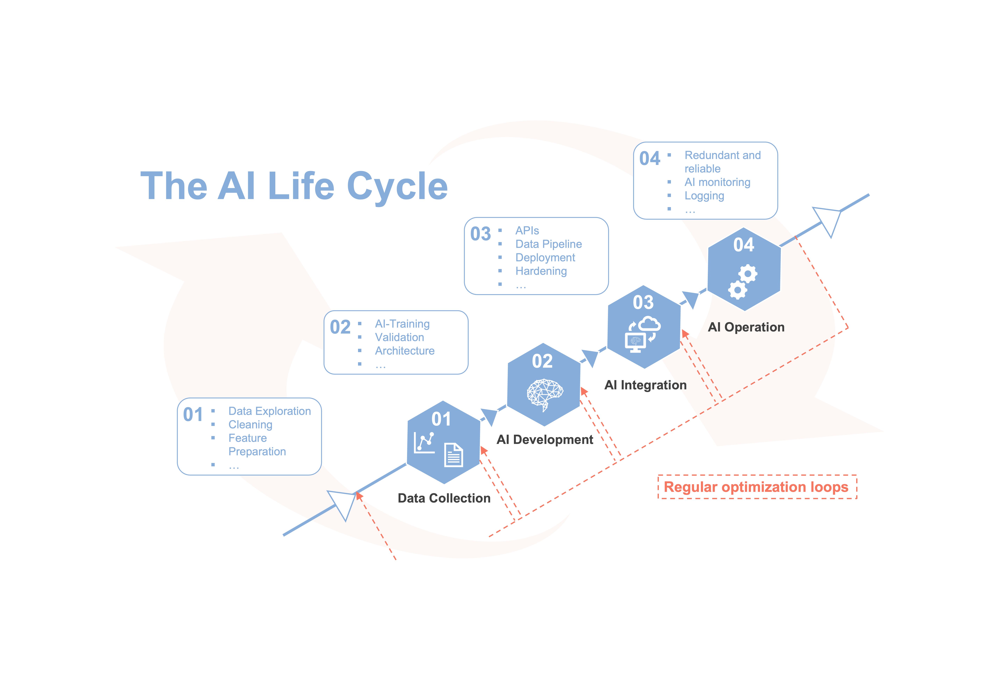

# matprop
Prediction of the Yield Strength as a Mechanical Properties of Steel.

# Dataset
The dataset can be downloaded from [Kaggle](https://www.kaggle.com/datasets/fuarresvij/steel-test-data)
It contains 13 different chemical elements as features:
+ carbon
+ magnesium
+ silicon
+ chromium
+ nickel
+ molybdenum
+ vanadium
+ nitrogen
+ niobium
+ cobalt
+ wolfram
+ aluminum
+ titan

And the Yield Strength as the target value that should be predicted by an AI model.

# Jupyter Notebooks
You can find two Jupyter Notebooks in this repository that lead you through parts of the AI Lifecycle:
+ 01_matprop_data_exploration.ipynb
+ 02_matprop_training.ipynb

